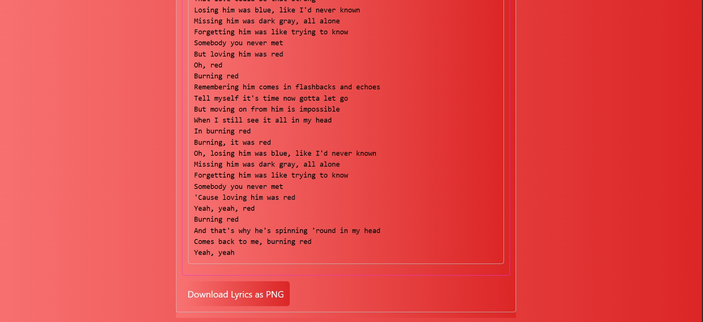
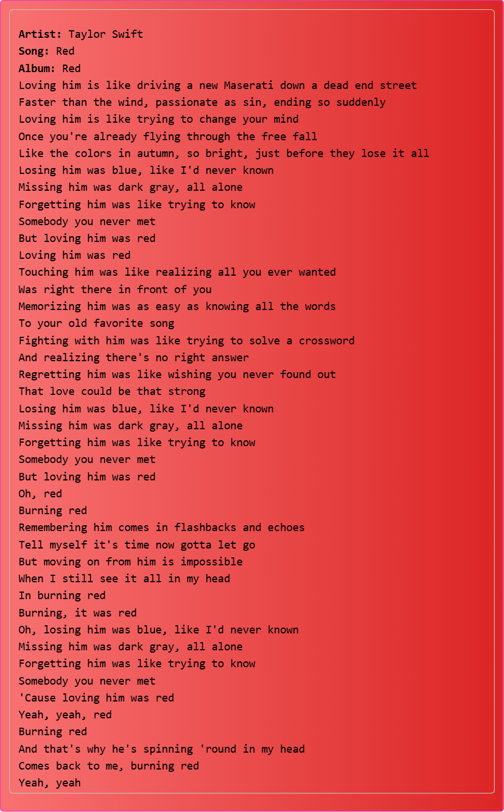
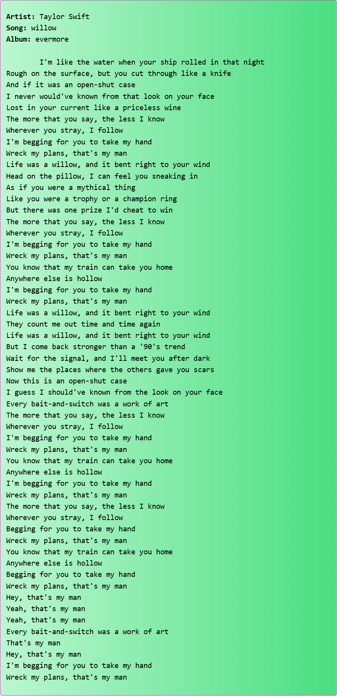

# LyricX( https://lyricx.onrender.com ) - MERN Stack Project :
A Taylor Swift Fandom project, this website aims to include all her songs by album.

This project was developed during my sophomore summer break to enhance my MERN stack skills, particularly in CSS, backend development, and API handling. Note that the database was not fully updated it make take some time to update the database with All taylor swift songs, there's like 300 of them.

## Goals

- **Improve CSS skills.**
- **Enhance backend project skills.**
  - I faced challenges with API calling and data fetching in previous MERN projects, especially when retrieving multiple data in a single call. This project helped me work on those issues and improve my proficiency.
## What it can do
1. Seach songs on database
2. Page changes color based on searched song's album
3. Download Lyric-card
4. Search songs based on albums
5. Page changes color based on searched album
6. Screenshots are added below
## Application Screenshots

- **Home Screen**
  
- **Search Songs**
  
  
  

  - **Download Songs-LyricCard**

    
    
    

- **Search Album**
  
  
  

## How to Use

1. Install dependencies:
   ```bash
   npm install
   ```
2. Start the development server:
   ```bash
    npm run dev
   ```
3. Navigate to the frontend directory:

```bash
cd c
```

```bash
npm install
```

```bash
npm start
```

##This should make your README.md file informative and user-friendly for anyone viewing your project on GitHub!
